# Carrot Task Bot User Guide

## Carrot Task Bot Ui

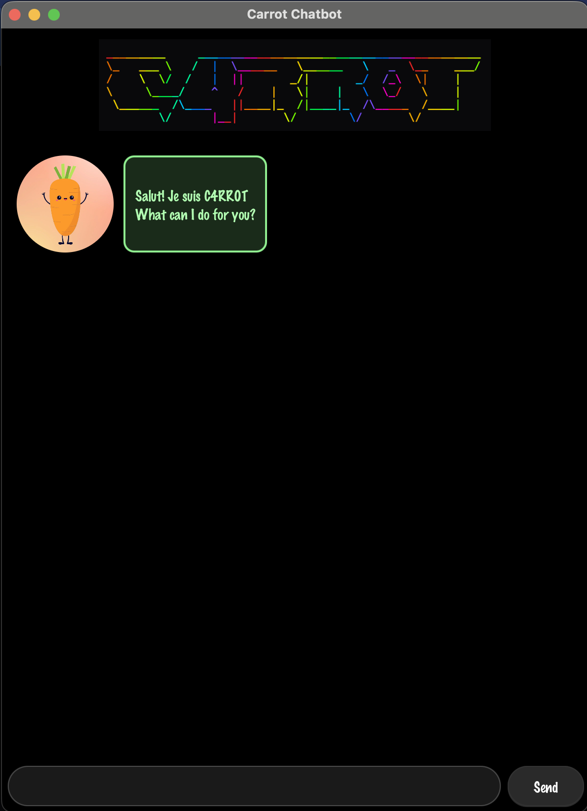

## 🥕 Meet Carrot Task Bot 

> Do you always forget to do your tasks on time?

> Do you want a simple and efficient way to manage your tasks, deadlines and events?

Look no further! Carrot Task Bot is your ultimate productivity companion. 
Whether you are tracking daily to do lists, strict project deadlines, 
or upcoming calendar events, keeping your life sorted has never been easier.

## Features of Carrot Task Bot

| **Feature**          | **Description**                           | **Example Usage**                                                |
|:---------------------|:------------------------------------------|:-----------------------------------------------------------------|
| Add ToDo Tasks       | Add tasks to your to-do list.             | `todo (task name)`                                               |
| Add Deadlines        | Set deadlines for your tasks.             | `deadline (deadline name) /by (date/time)`                       |
| Add Events           | Schedule events with start and end times. | `event (event name) /from (start date/time) /to (end date/time)` |
| List Events          | View all your scheduled events.           | `list`                                                           |
| Update Task          | Update task fields                        | `update (task number) (arguments)`                               |
| Mark Tasks as Done   | Mark tasks as completed.                  | `mark (task number)`                                             |
| Unmark Tasks as Done | Mark tasks as not completed.              | `unmark (task number)`                                           |
| Delete Tasks         | Remove tasks from your list.              | `delete (task number)`                                           |
| Find Tasks           | Search for tasks containing a keyword.    | `find (keyword)`                                                 |
| Clear Tasks          | Clear all tasks from the list.            | `clear`                                                          |
| Help                 | Get a list of available commands.         | `help`                                                           |
| Exit                 | Exit the application.                     | `bye`                                                            |

## Addition of Tasks
There are three types of tasks that can be added to Carrot Task Bot: To-Do Tasks, Deadlines and Events. Each type of task has its own specific command format for addition. The following sections will provide details on how to add each type of task, along with examples of usage and expected outcomes.

### Adding To-Do Tasks

Todo tasks are simple tasks that do not have a specific deadline or time frame. They are used for general task management and can be added to your to-do list.

Example: `todo Complete CS2103T Project`

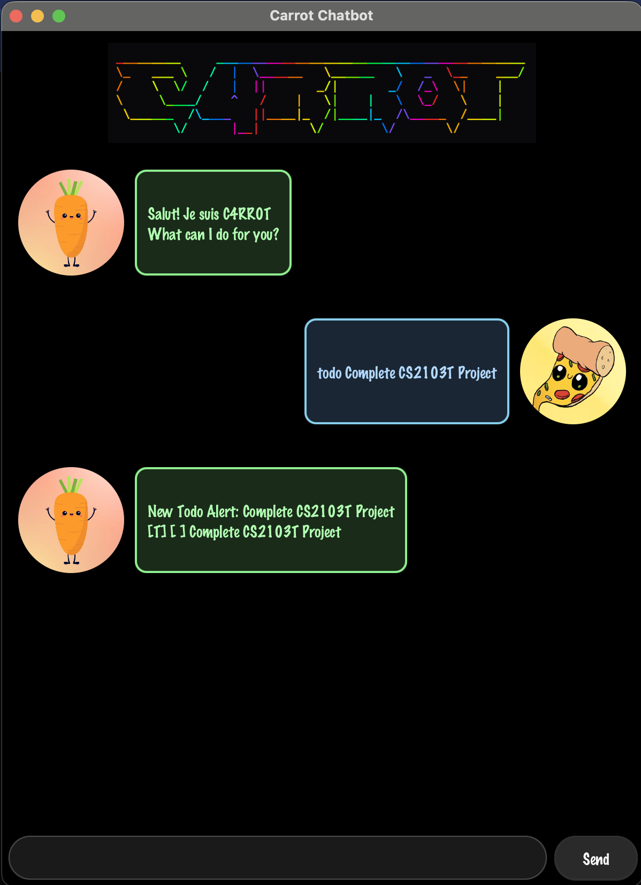

Reply
```
New Todo Alert: Complete CS2103T Project
[T] [ ] Complete CS2103T Project
```
### Adding deadlines

Deadlines are tasks that have a specific due date and time. They are used for tasks that need to be completed by a certain deadline.

Example: `deadline Complete CS3235 Homework /by 2026-02-26`

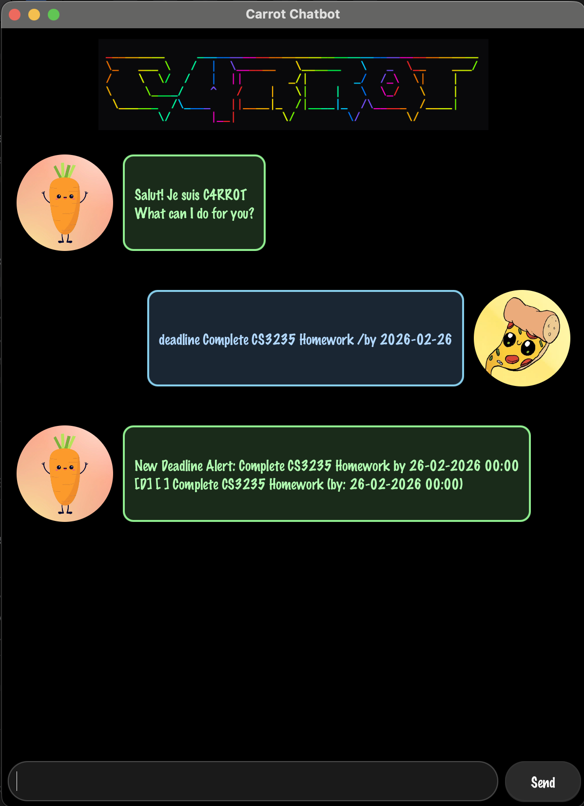

Reply
```
New Deadline Alert: Complete CS3235 Homework by 26-02-2026 00:00
[D] [ ] Complete CS3235 Homework (by: 26-02-2026 00:00)
```

### Adding Events

Events are tasks that have a specific start and end date and time. They are used for scheduling events or appointments.

Example: `event CS2103T Lecture /from 2026-03-06 16:00 /to 2026-03-06 18:00`

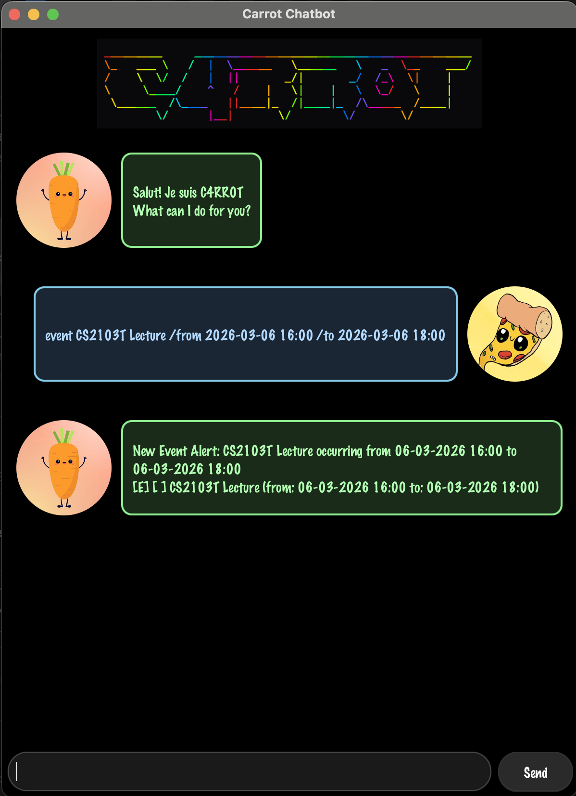

Reply
```
New Event Alert: CS2103T Lecture from 06-03-2026 16:00 to 06-03-2026 18:00
[E] [ ] CS2103T Lecture (from: 06-03-2026 16:00 to: 06-03-2026 18:00)
```

## Listing Events

Listing events allows you to view all your tasks, deadlines and, scheduled events in a clear and organized manner. This feature is particularly useful for keeping track of your upcoming commitments and ensuring that you do not miss any important events.

Example: `list`

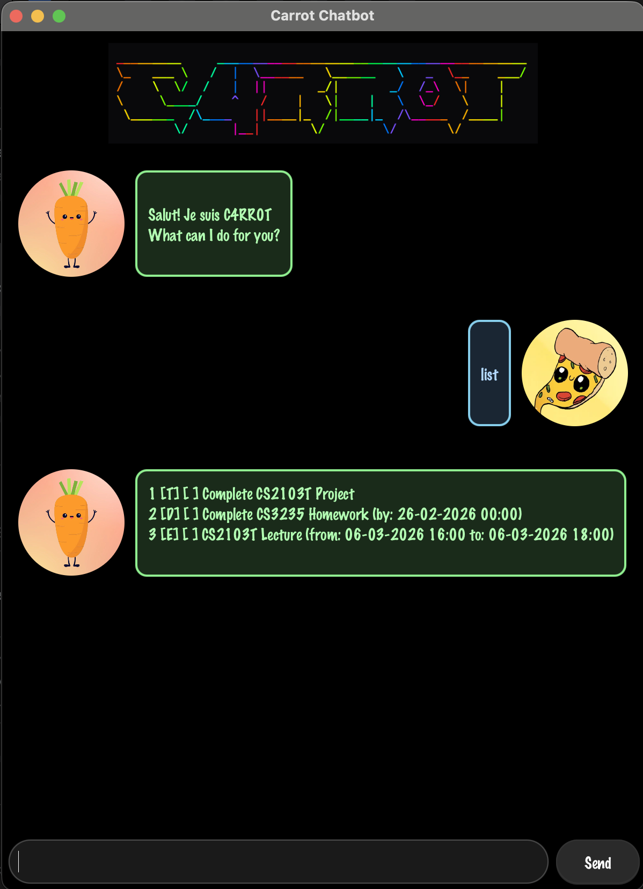

Reply
```
1 .[T][ ] Complete CS2103T Project
2 .[D][ ] Complete CS3235 Homework (by: 26-02-2026 00:00)
3 .[E][ ] CS2103T Lecture (from: 06-03-2026 16:00 to: 06-03-2026 18:00)
```

## Updating Tasks

Updating tasks allows you to modify the details of your existing tasks, deadlines and events. This feature is useful for making changes to your schedule or correcting any mistakes in the task details.

Prefix: `update (task number) (arguments)`
Arguments:
- `/d` description
- `/by` due by (Only available for Deadlines)
- `/from` Start Date and Time `YYYY-MM-DD HH:MM` (Only available for Events)
- `/to` Start Date and Time `YYYY-MM-DD HH:MM` (Only available for Events)

### Updating Task Description

Example: `update 1 /d Complete CS2101 CA2`

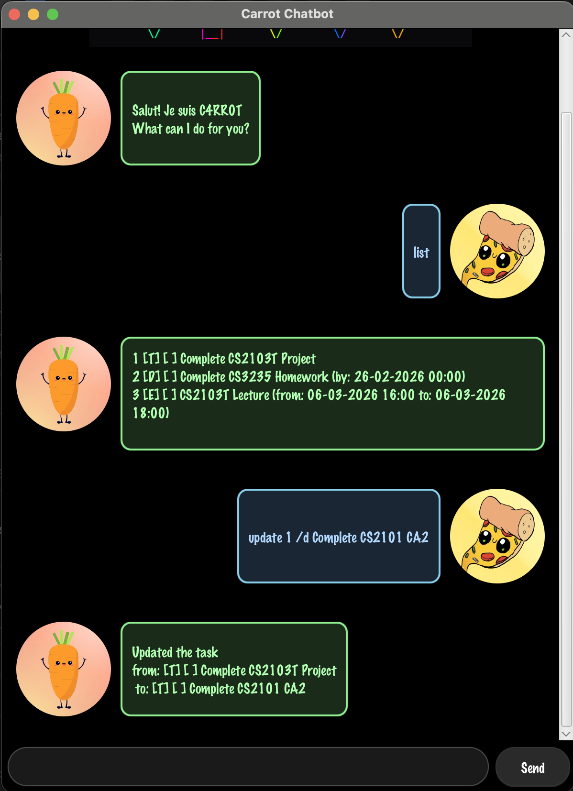

Reply
```
Updated the task
from: [T][ ] Complete CS2103T Project
to: [T][ ] Complete CS2101 CA2
```

### Updating Deadline

Example: `update 2 /d Complete C2103T Practical`


Reply
```
Updated the task
from: [D][ ] Complete CS3235 Homework (by: 26-02-2026 00:00)
to: [D][ ] Complete C2103T Practical (by: 26-02-2026 00:00)
```

Example: `update 2 /by 2026-02-28`

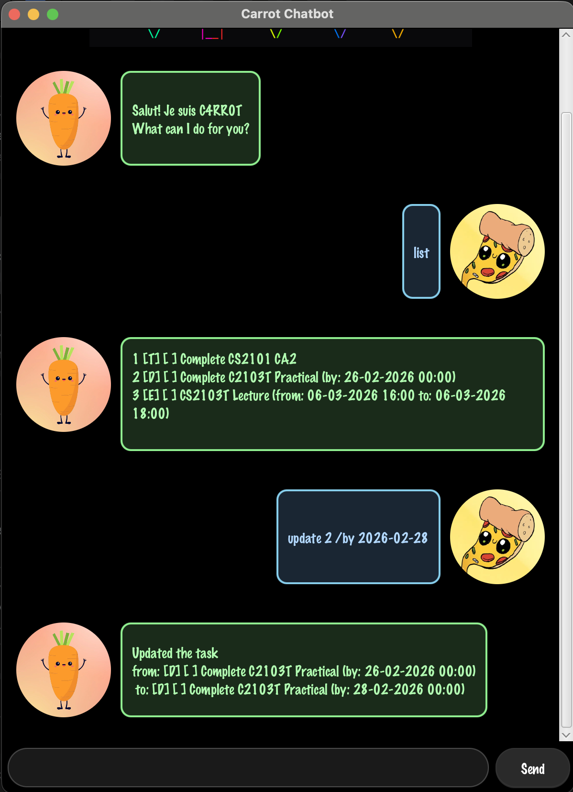

Reply
```
Updated the task
from: [D][ ] Complete C2103T Practical (by: 26-02-2026 00:00)
to: [D][ ] Complete C2103T Practical (by: 28-02-2026 00:00)
```

Example: `update 2 /by 2026-02-28 23:59`

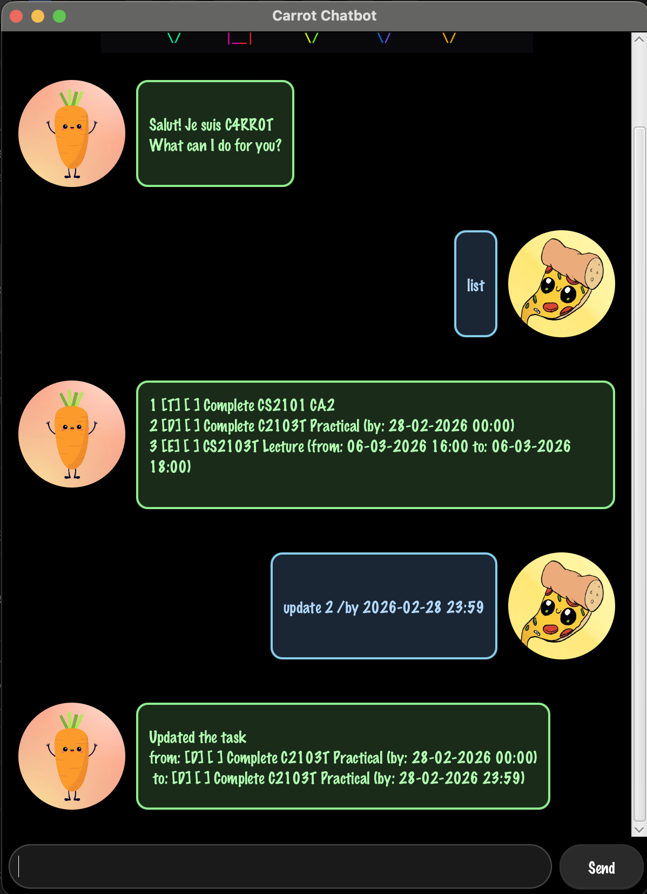

Reply
```
Updated the task
from: [D][ ] Complete C2103T Practical (by: 26-02-2026 00:00)
to: [D][ ] Complete C2103T Practical (by: 28-02-2026 23:59)
```

### Updating Event Timing

Example: `update 3 /d CS2101 Lecture`

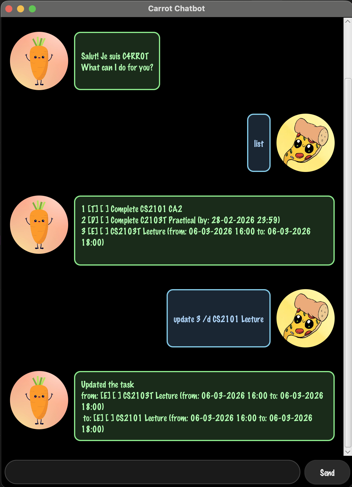

Reply
```
Updated the task
from: [E][ ] CS2103T Lecture (from: 06-03-2026 16:00 to: 06-03-2026 18:00)
to: [E][ ] CS2101 Lecture (from: 06-03-2026 16:00 to: 06-03-2026 18:00)
```

Example: `update 3 /to 2026-03-13`


Reply
```
Updated the task
from: [E][ ] CS2101 Lecture (from: 06-03-2026 16:00 to: 06-03-2026 18:00)
to: [E][ ] CS2101 Lecture (from: 06-03-2026 16:00 to: 13-03-2026 00:00)
```

Example: `update 3 /from 2026-03-13`


Reply
```
Updated the task
from: [E][ ] CS2101 Lecture (from: 06-03-2026 16:00 to: 13-03-2026 00:00)
to: [E][ ] CS2101 Lecture (from: 13-03-2026 00:00 to: 13-03-2026 00:00)
```

Example: `update 3 /from 2026-03-13 16:00 /to 2026-03-13 18:00`

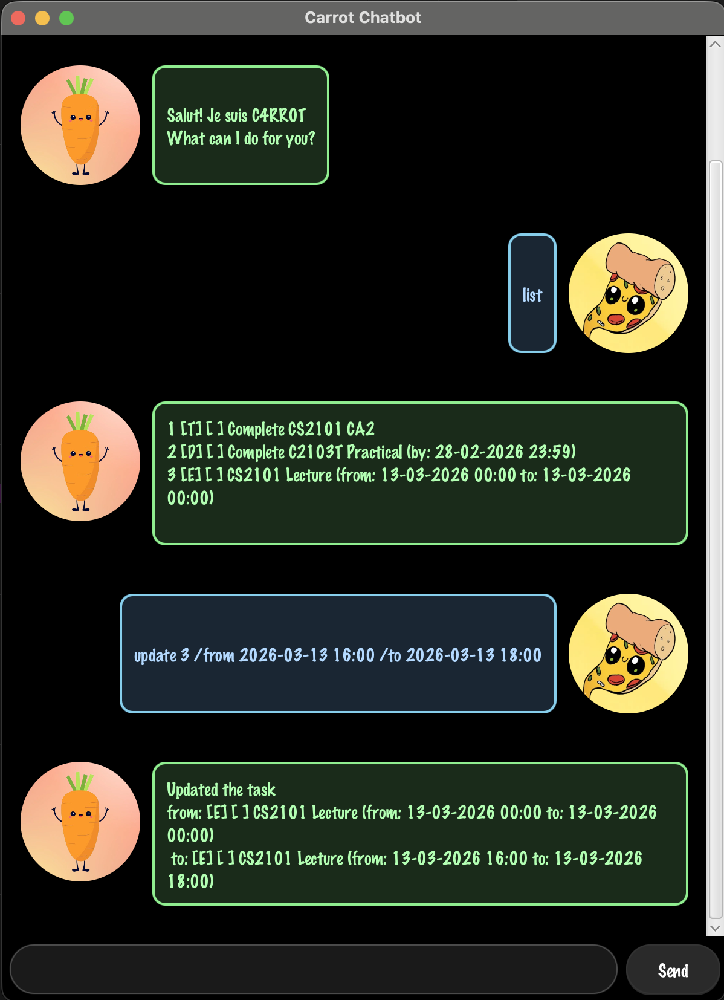

Reply
```
Updated the task
from: [E][ ] CS2101 Lecture (from: 13-03-2026 16:00 to: 13-03-2026 18:00)
to: [E][ ] CS2101 Lecture (from: 13-03-2026 16:00 to: 13-03-2026 18:00)
```

## Marking Tasks as Done

Marking tasks as done allows you to indicate that a task has been completed. This feature is useful for keeping track of your progress and ensuring that you can easily identify which tasks have been completed and which are still pending.

Example: `mark 1`

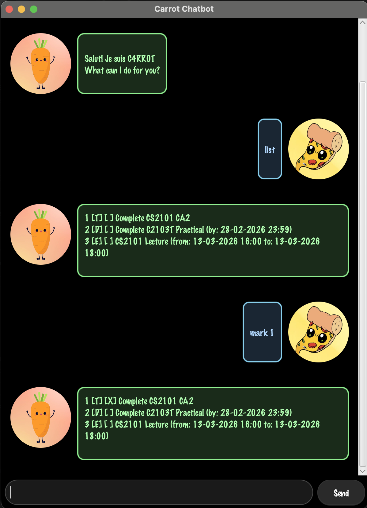

Reply
```
1. [T][X] Complete CS2101 CA2
2. [D][ ] Complete C2103T Practical (by: 28-02-2026 23:59)
3. [E][ ] CS2101 Lecture (from: 13-03-2026 16:00 to: 13-03-2026 18:00)
```

## Unmarking Tasks as Done

Unmarking tasks as done allows you to indicate that a task is not completed. This feature is useful for correcting any mistakes or indicating that a task needs to be revisited.

Example: `unmark 1`


Reply
```
1. [T][ ] Complete CS2101 CA2
2. [D][ ] Complete C2103T Practical (by: 28-02-2026 23:59)
3. [E][ ] CS2101 Lecture (from: 13-03-2026 16:00 to: 13-03-2026 18:00)
```

## Deleting Tasks

Deleting tasks allows you to remove tasks from your list. This feature is useful for keeping your task list organized and removing any tasks that are no longer relevant.

Example: `delete 1`

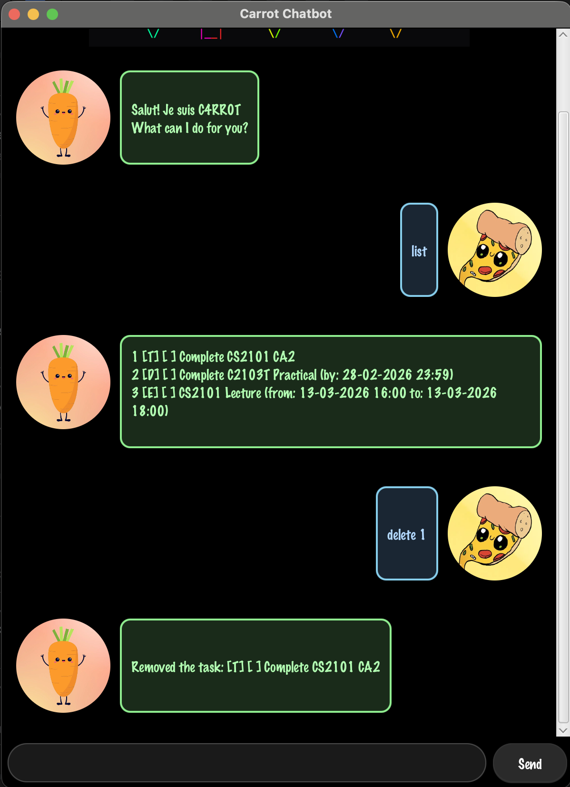

Reply
```
Removed the task: [T][ ] Complete CS2101 CA2
```

## Getting Help

Providing help allows you to access a list of available commands and their descriptions. This feature is useful for new users who may not be familiar with all the commands or for users who need a quick reference.

Example: `help`

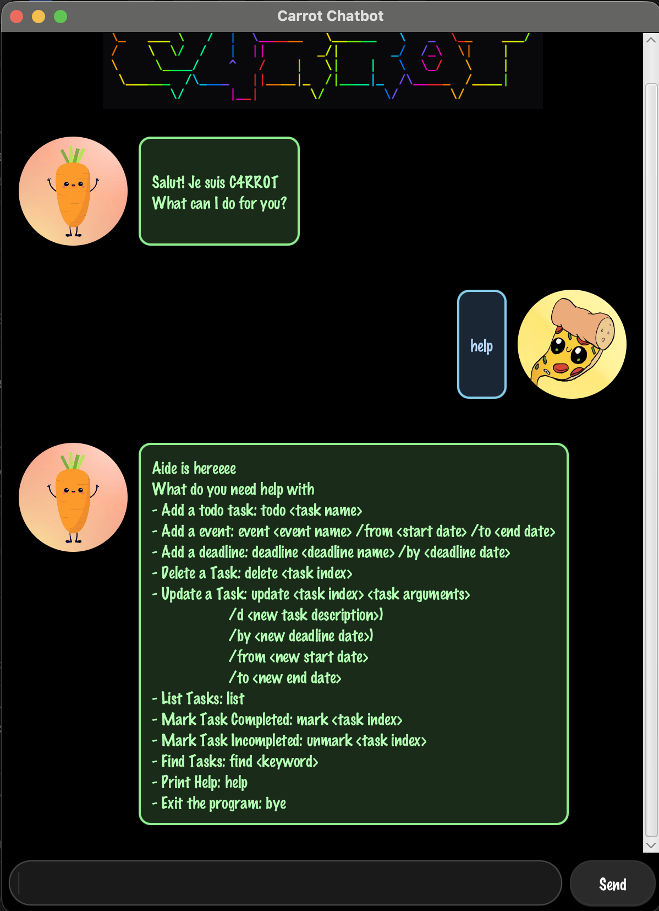

Reply
```
Aide is hereeee
What do you need help with
- Add a todo task: todo <task name>
- Add a event: event <event name> /from <start date> /to <end date>
- Add a deadline: deadline <deadline name> /by <deadline date>
- Delete a Task: delete <task index>
- Update a Task: update <task index> <task arguments>
                    /d <new task description>)
                    /by <new deadline date>)
                    /from <new start date>
                    /to <new end date>
- List Tasks: list
- Mark Task Completed: mark <task index>
- Mark Task Incompleted: unmark <task index>
- Find Tasks: find <keyword>
- Print Help: help
- Exit the program: bye
```

## Exiting the Application

Exiting the application allows you to close Carrot Task Bot when you are finished using it. This feature is useful for ensuring that you can easily exit the application when you are done managing your tasks.

Example: `bye`

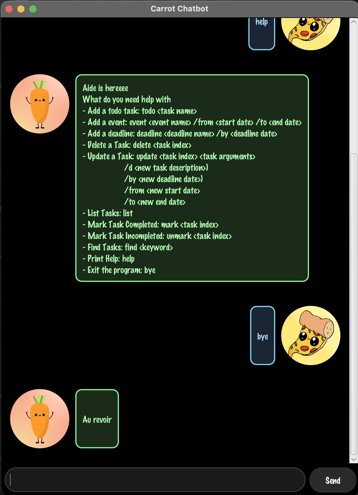

Reply
```
Au revoir
```
